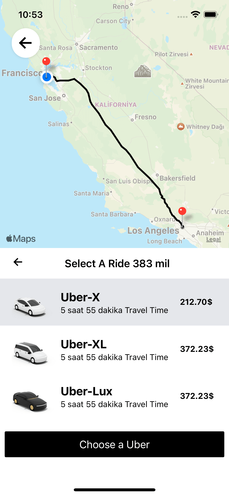

#  React Native Uber Clone App

####  Libraries
- Native Wind (Tailwind CSS) 
- React Native Maps
- React Navigation 
- Zustand (State Management)

## Environment Variables

To run this project, you will need to add the following environment variables to your .env file.
Google Cloud API key has to enabled access at the below APIs: 
- Distance Matrix API
- Directions API
- Places API

## Screenshots

